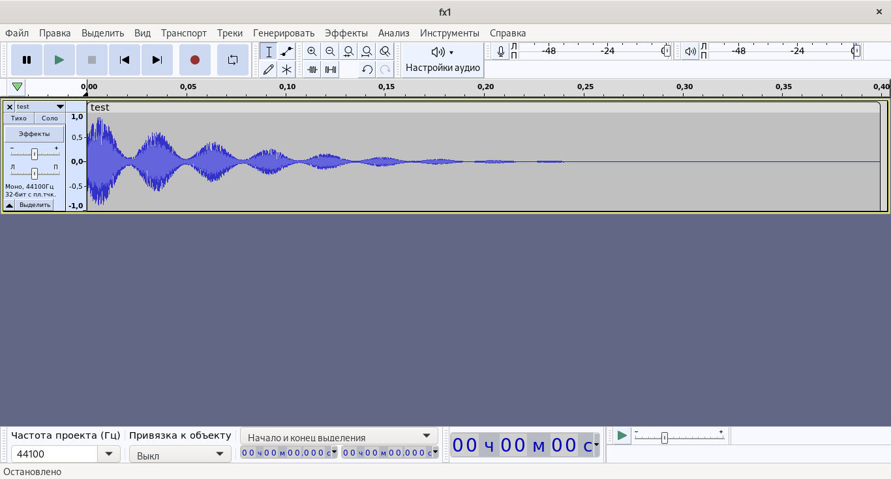

# RPSG: Reverse Polish Sound Generator (не курва, а потому-что постфиксный)
Короче, так как я поставусил себе линух и флОЧКи тута нет, то генерировать новые саунды Европы для моих пробебриков придётся изворачиваясь и придумывая свои придумки.

**Перевод с даунского:** В общем, эта программа предназначена для т. н. *звукового программирования*, тобишь для синтеза звука при помощи программного кода. А вообще, есть целые жанры, посвящённые такой музыке, к примеру тот же *bytebeat*, или как там его. Отсюда сразу следует плюс: *не нужно хранить звуковые семплы и тратить место, если можно хранить инструкцию (программу), как звук создать.* Полезно для тех, кто самоудовлетворяется на демосцены и прочие девиации.

## Как начать?

Первым делом надо собрать проект, а так как я теперь линуксоид, то и инструкция будет для Линукса.

Сначала раздобудьте где-нибудь CMake. Я хз, идёт ли он с каими-то дистрибутивами сразу, но лично я из магазина Debian что-то скачал, там гайды сами найдёте. А, и Git тоже нужен.

Зайдите в терминал и готовьтесь копипастить следующие команды: скопируйте репозиторий

    habaisuniversegod@habacomp:~$ git clone https://github.com/habaisuniversegod/RPSG.git

Появится директория `RPSG`. В ней будут файлы со всем стаффом. Перейдём туда:

    habaisuniversegod@habacomp:~$ cd RPSG
    habaisuniversegod@habacomp:~/RPSG$

Можно посмотреть, что там есть:

    habaisuniversegod@habacomp:~/RPSG$ ls
    CMakeLists.txt  eval.h    lexer.cpp  main.cpp   wsave.cpp
    eval.cpp        examples  lexer.h    README.md  wsave.h

Нам это безразлично на самом деле, так что едем дальше.

Создайте новую директорию, где всё и соберётся. Назвать можно как душе заблагорассудится. Потом в неё надо будет зайти:

    habaisuniversegod@habacomp:~/RPSG$ mkdir tmp
    habaisuniversegod@habacomp:~/RPSG$ cd tmp
    habaisuniversegod@habacomp:~/RPSG/tmp$ 

Натравливаем на это дело CMake:

    habaisuniversegod@habacomp:~/RPSG/tmp$ cmake ..

Дальше ждём и если ошибок нет, мы должны получить файлик Makefile:

    habaisuniversegod@habacomp:~/RPSG/tmp$ ls
    CMakeCache.txt  CMakeFiles  cmake_install.cmake  Makefile

Натравливаем утилиту `make` на это добро:

    habaisuniversegod@habacomp:~/RPSG/tmp$ make

Если ошибок нет, то в текущей директории появится исполняемый файл `main`.

Да впринципе готово, его можно хоть щас запустить, но без аргументов оно не попрёт, так что чтиай джоки дальше...

## Запуск

Формат аргументов таков:
    
    habaisuniversegod@habacomp:~/RPSG/tmp$ ./main <файл с кодом> <частота дискретизации> <длина (в секундах)> <выходной аудио-файл в формате .wav>

Можно проверить примеры из папки `examples`:

    habaisuniversegod@habacomp:~/RPSG/tmp$ ./main ../examples/ex1-0.4s.txt 44100 0.4 test.wav

В папке с исполняемым файлом появится наш эпичнейший KSHMR Snare или Ride или Open Hat, я хз. Можно открыть в Audacity, позырить, пощёлкать, послушать:

Если открыть файл `examples/ex1-0.4s.txt`, то увидим непонятный для вас текст:

    $ 200 div
    sin
    1.25 add
    2.25 div
    rand mul
    1
    $ # div
    sub
    5 pow
    mul

Те, кто шарят за форты или PostScript'ы или в целом за стековые вычисления, они поймут. А для вас я потом доки напишу, щас лень уже UwU

